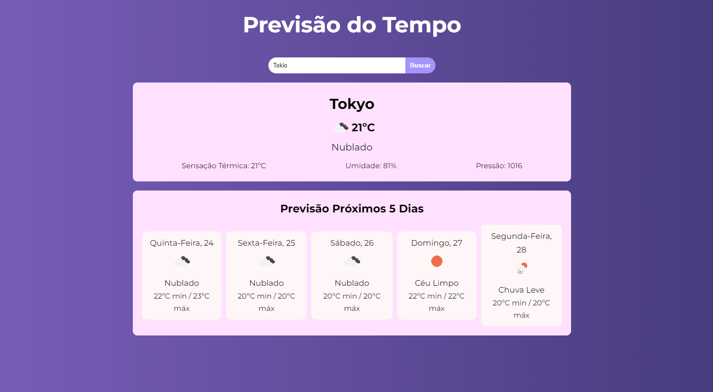

# Weather Forecast - React + API OpenWeather

---

This is a web application project developed using React that consumes the Open Weather API. This project allows the user to enter the name of any city around the world to check weather information for the desired city.

